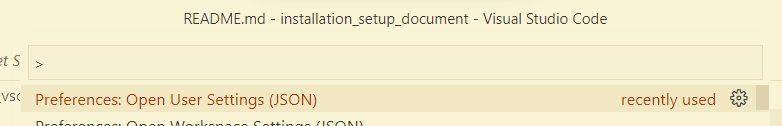
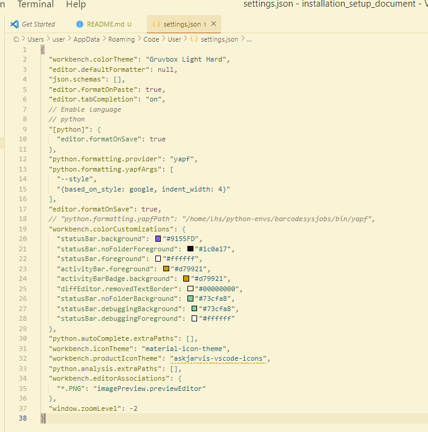

# Tutorial for setting up the code styling using YAPF in VS Code

## 1. Install YAPF on your computer
```ps
pip install yapf
```

## 2. Open VS Code
### 2.1 Press ```CTRL + SHIFT + P```
### 2.2 Search and Open ```Preferences: Open User Setting (JSON) ```


### 2.3 Update the YAPF script in the JSON file
```JSON
{
  "workbench.colorTheme": "Gruvbox Light Hard",
  "editor.defaultFormatter": null,
  "json.schemas": [],
  "editor.formatOnPaste": true,
  "editor.tabCompletion": "on",
  // Enable language
  // python
  "[python]": {
    "editor.formatOnSave": true
  },
  "python.formatting.provider": "yapf",
  "python.formatting.yapfArgs": [
    "--style",
    "{based_on_style: google, indent_width: 4}"
  ],
  "editor.formatOnSave": true,
  // "python.formatting.yapfPath": "/home/lhs/python-envs/barcodesysjobs/bin/yapf",
  "workbench.colorCustomizations": {
    "statusBar.background": "#9155FD",
    "statusBar.noFolderForeground": "#1c0a17",
    "statusBar.foreground": "#ffffff",
    "activityBar.foreground": "#d79921",
    "activityBarBadge.background": "#d79921",
    "diffEditor.removedTextBorder": "#00000000",
    "statusBar.noFolderBackground": "#73cfa8",
    "statusBar.debuggingBackground": "#73cfa8",
    "statusBar.debuggingForeground": "#ffffff"
  },
  "python.autoComplete.extraPaths": [],
  "workbench.iconTheme": "material-icon-theme",
  "workbench.productIconTheme": "askjarvis-vscode-icons",
  "python.analysis.extraPaths": [],
  "workbench.editorAssociations": {
    "*.PNG": "imagePreview.previewEditor"
  }
}
```

